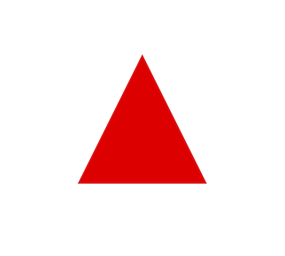

# Example 1 - Getting Started

Draw a triangle.

Download `index.html` and `index.js` into the same folder and open `index.html` in a browser to view example.



## Code

```html
<!-- index.html -->
<!doctype html>
<html>
<body>
    <div id="figureOneContainer" style="width: 500px; height: 500px; background-color: black;">
    </div>
    <script type="text/javascript" src='https://cdn.jsdelivr.net/npm/figureone@0.3.3/figureone.min.js'></script>
    <script type="text/javascript" src='./index.js'></script>
</body>
</html>
```

```js
// index.js

// Create a figure
const figure = new Fig.Figure();

// Add a triangle
figure.addElement(
  {
    name: 'tri',
    method: 'triangle',
    options: {
      width: 1,
      height: 1,
      color: [1, 0, 0, 1],
    },
  },
);


```
## Explanation

### HTML
In the HTML, a `div` is created that will house the figure.
```html
 <div id="figureOneContainer" style="width: 500px; height: 500px; background-color: black;">
 ```

Then the FigureOne library is loaded
```html
<script type="text/javascript" src='https://cdn.jsdelivr.net/npm/figureone@0.3.3/figureone.min.js'></script>
```
In this case, the library is loaded from a CDN, but you could also run it from a local copy of the figureone library as well. For instance, if you cloned this repository, and wanted to run the local version you could use the line:
```html
<script type="text/javascript" src='../../package/figureone.min.js'></script>
```

Finally, the javascript file which will use the FigureOne library to create the figure is executed.

```html
<script type="text/javascript" src='./index.js'></script>
```

All other examples have the same, or very similar HTML index file, and so it will only be mentioned again if it changes.

### Javascript

First a figure is created. `Fig` is the FigureOne library globally available after loading the script.

```js
const figure = new Fig.Figure();
```

A *figure* is an object that manages figure elements (class `FigureElement`). By default it attaches to a HTML `div` element with id `figureOneContainer`. A custom id can also be used by using a `htmlId` parameter when creating the figure:

```js
const figure = new Fig.Figure({ htmlId: 'customId' });
```

Next, a figure element in the shape of a triangle is added.

```js
figure.addElement(
  {
    name: 'tri',
    method: 'triangle',
    options: {
      width: 1,
      height: 1,
      color: [1, 0, 0, 1],
    },
  },
);

```

We are defining a *triangle* figure element using the `triangle` method with the parameters of `width`, `height`, and `color`.


<!-- [link here](../../docs/README.md#TypeEquationPhrase) -->