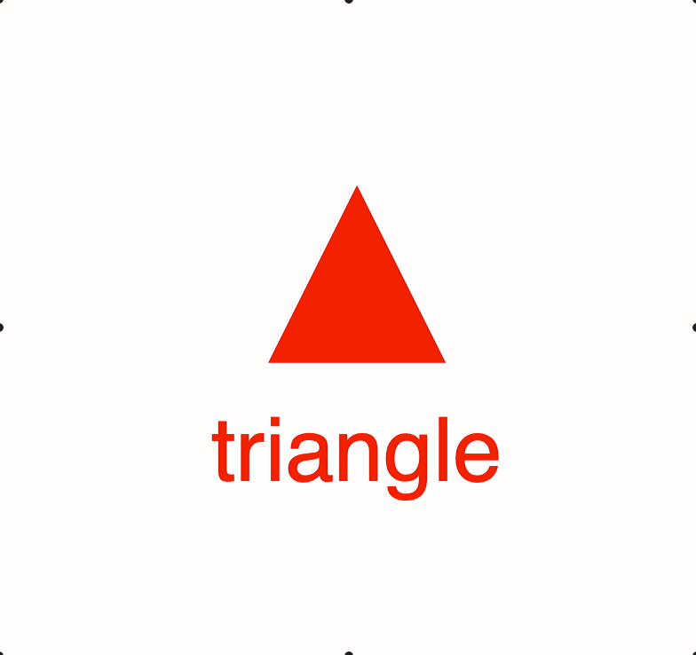

# Example 2 - Collections

This example shows a triangle and text in a collection. The collection is rotated, so both the triangle and text are also rotated.

Open `index.html` in a browser to view example.



## Code
```js
// index.js

// Initialize the figure with a default color
const figure = new Fig.Figure({ color: [1, 0, 0, 1] });

figure.add(
  {
    name: 'c',
    method: 'collection',
    elements: [        // Add two elements to the collection
      {
        name: 'tri',
        method: 'triangle',
        options: {
          height: 0.4,
          width: 0.4,
        },
      },
      {
        name: 'text',
        method: 'text',
        options: {
          text: 'triangle',
          position: [0, -0.4],
          xAlign: 'center',
        },
      },
    ],
  },
);

// When a collection rotates, then so does all its elements
figure.getElement('c').animations.new()
  .rotation({ target: Math.PI * 1.999, direction: 1, duration: 5 })
  .start();
```

## Explanation

There are two types of figure elements (subclasses of [FigureElement](https://airladon.github.io/FigureOne/#figureelement)):

* [FigureElementPrimitive](https://airladon.github.io/FigureOne/#figureelementprimitive) - An object that manages a drawing primitive like a set of vertices, some text or a html element
* [FigureElementCollection](https://airladon.github.io/FigureOne/#figureelementcollection) - An object that manages a group of drawing elements (can be both primitives and collections)

All drawing elements have their own `transform` that *translates*, *rotates* and/or *scales* the element.

A drawing element in a collection will be transformed by both its own transform, and its parent collection's transform.

That way, if drawing elements should be moved or scaled together, they can be added to a collection and that collection can collectively move/scale them.

Thus, a drawing element in a hierarchy of collections will be transformed by the chain of all its hierarchical parents.

This example also shows how a figure element can be accessed. The main [Figure](https://airladon.github.io/FigureOne/#figure) and all [FigureElementCollection](https://airladon.github.io/FigureOne/#figureelementcollection)s have a `getElement` method, to which a string can be passed with the elements name. In the example above, the collection element is retrieved by:

```js
figure.getElement('c')
```

`'.'` characters can be used to get elements within nested collections. So, if we wanted to retrieve the `'tri'`  element, we could use:

```js
figure.getElement('c.tri');
```

## Alternative element creation

The above example uses an object hierarchy to define the figure elements. It is sometimes more useful to instantiate the elements separately. All figure elements can be created using methods within [figure.primitives](https://airladon.github.io/FigureOne/#figureprimitives) or [figure.collections](https://airladon.github.io/FigureOne/#figureprimitives).

The above example can be rewritten as:

```js
const tri = figure.primitives.triangle({
  name: 'tri',
  height: 0.4,
  width: 0.4,
});

const text = figure.primitives.text({
  name: 'text',
  text: 'triangle',
  position: [0, -0.4],
  xAlign: 'center',
});

const c = figure.collections.collection({
  name: 'c',
});
c.add([tri, text]);

figure.add(c);
```
