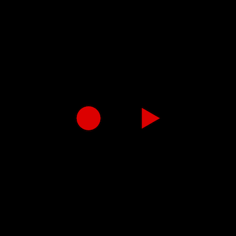

# Example 2 - Collections

This example shows a triangle and a circle in a collection. The collection is scaled and so both the triangle and circle are scaled by the collection.

Open `index.html` in a browser to view example.



## Code
`index.js`
```js
const diagram = new Fig.Diagram();

// Add a collection with a circle and triangle in it to the diagram
diagram.addElement(
  {
    name: 'shapes',
    method: 'collection',
    addElements: [
      {
        name: 'circle',
        method: 'polygon',
        options: {
          sides: 100,
          radius: 0.2,
          fill: true,
          color: [1, 0, 0, 1],
          position: [-0.5, 0],
        },
      },
      {
        name: 'triangle',
        method: 'polygon',
        options: {
          sides: 3,
          radius: 0.2,
          fill: true,
          color: [1, 0, 0, 1],
          position: [0.5, 0],
        },
      }
    ],
  },
);

// Scale the shapes collection
// This will reduce the size of both the circle and triangle
diagram.getElement('shapes').setScale(0.5),

diagram.initialize();

```

## Explanation

There are two types of diagram elements (subclasses of `DiagramElement`):

* `DiagramElementPrimitive` - An object that manages a drawing primitive like a set of vertices, some text or a html element
* `DiagramElementCollection` - An object that manages a group of drawing elements (could be both primitives and collections)

All drawing elements have their own `transform` that *translates*, *rotates* and/or *scales* the element.

A drawing element in a collection will be transformed by both its own transform, and its parent collection's transform.

That way, if drawing elements should be moved or scaled together, they can be added to a collection and that collection can collectively move/scale them.

Thus, a drawing element in a hierarchy of collections will be transformed by the chain of all its hierarchical parents.
