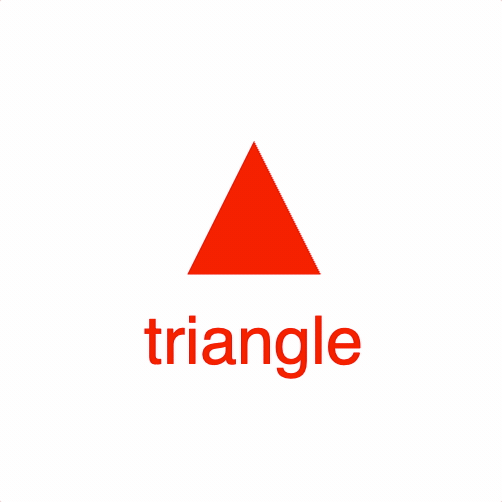

# Example 2 - Collections

This example shows a triangle and text in a collection. The collection is rotated, so both the triangle and text are also rotated..

Open `index.html` in a browser to view example.



## Code
```js
// index.js

// Initialize the figure with a default color
const figure = new Fig.Figure({ color: [1, 0, 0, 1] });

figure.addElement(
  {
    name: 'c',
    method: 'collection',
    addElements: [        // Add two elements to the collection
      {
        name: 'tri',
        method: 'triangle',
        options: {
          height: 0.4,
          width: 0.4,
        },
      },
      {
        name: 'text',
        method: 'text',
        options: {
          text: 'triangle',
          position: [0, -0.4],
          xAlign: 'center',
        },
      },
    ],
  },
);

// When a collection rotates, then so does all its elements
figure.getElement('c').animations.new()
  .rotation({ target: Math.PI * 1.999, direction: 1, duration: 5 })
  .start();
```

## Explanation

There are two types of figure elements (subclasses of [FigureElement](https://airladon.github.io/FigureOne/#figureElement)):

* [FigureElementPrimitive](https://airladon.github.io/FigureOne/#figureelementprimitive) - An object that manages a drawing primitive like a set of vertices, some text or a html element
* [FigureElementCollection](https://airladon.github.io/FigureOne/#figureelementcollection) - An object that manages a group of drawing elements (can be both primitives and collections)

All drawing elements have their own `transform` that *translates*, *rotates* and/or *scales* the element.

A drawing element in a collection will be transformed by both its own transform, and its parent collection's transform.

That way, if drawing elements should be moved or scaled together, they can be added to a collection and that collection can collectively move/scale them.

Thus, a drawing element in a hierarchy of collections will be transformed by the chain of all its hierarchical parents.
