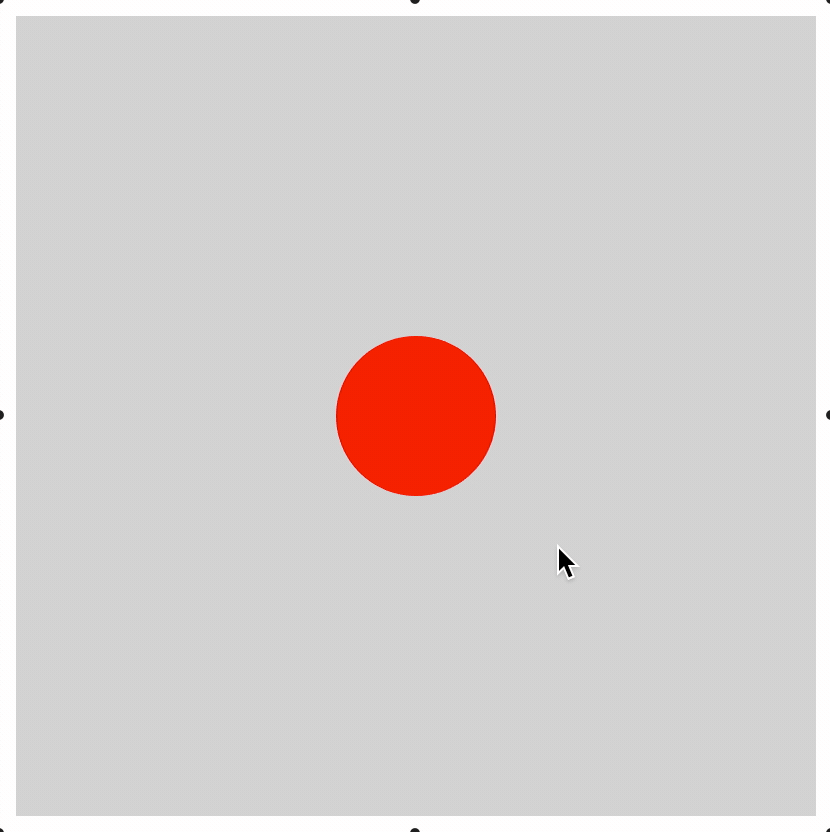

# Example 3 - Interactive Shape

This example shows a circle that can be moved in the container.

If the shape is released while dragging, it will continue to travel in its last dragged direction, and bounce of the container boundaries if it reaches them.

Open `index.html` in a browser to view example.



## Code
`index.js`
```js
// Create figure and make it able to be touched
const figure = new Fig.Figure();
figure.setTouchable();

// Add circle to figure
figure.add(
  {
    name: 'circle',
    method: 'polygon',
    options: {
      sides: 100,
      radius: 0.2,
      fill: true,
      color: [1, 0, 0, 1],
    },
    mods: {
      isTouchable: true,
      isMovable: true,
      move: {
        canBeMovedAfterLosingTouch: true,
        boundary: 'figure',
      },
    },
  },
);

// Initialize figure
figure.initialize();
```

## Explanation
Figure elements can be touched, moved, released (to move freely) and animated.

This example shows how an element can be setup to be moved and bounce of the figure walls so it stays within the figures limits. By default, the object will move freely when released.

```js
    options: {
      sides: 100,
      radius: 0.2,
      fill: true,
      color: [1, 0, 0, 1],
    },
```

The `options` key in the circle definition defines parameters specific to the `polygon` shape creator method.

```js
    mods: {
      isTouchable: true,
      isMovable: true,
      move: {
        canBeMovedAfterLosingTouch: true,
        boundary: 'figure',
      },
    },
```

The `mods` key in the circle definition can be used to set properties that belong to every `FigureElement`. For instance, all figure elements (`FigureElementCollection` and `FigureElementPrimitive` objects) have a `isTouchable` property that by default is `false`. In this case, we are setting it to `true`.

Properties of figure elements may also be *objects*. For example, all figure elements have a `move` object property that includes the properties `canBeMovedAfterLosingTouch` and `boundary`, as well as a number of others. Only the properties defined in `mods` will overwrite those in the figure element. Other properties that are not defined (including those within the `move` object) will retian their default values.
