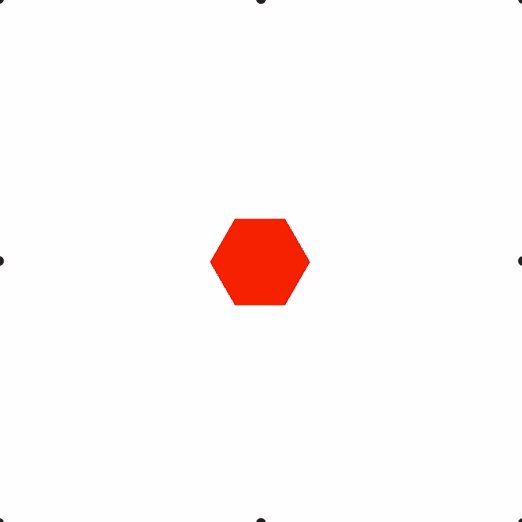

# Example 4 - Animation

A pentagon shape goes through a series of animation steps including translations, rotations, pulses, and dissolves.

Open `index.html` in a browser to view example.



## Code
```js
const figure = new Fig.Figure();

// Add a simple shape to the figure
figure.add([
  {
    name: 'hexagon',
    method: 'polygon',
    options: {
      sides: 6,
      radius: 0.2,
      fill: true,
      color: [1, 0, 0, 1],
    },
  },
]);

// Start a new animation
figure.getElement('hexagon').animations.new()
  .position({ target: [-0.4, -0.4], velocity: 0.3 })
  .rotation({ delta: Math.PI / 2, duration: 1 })
  .position({ target: [0, 0], velocity: 0.3 })
  .pulse({ duration: 1 })
  .rotation({ delta: Math.PI / 2, duration: 1 })
  .dissolveOut({ duration: 1 })
  .dissolveIn({ duration: 1 })
  .position({ target: [-0.5, 0.5], velocity: 0.3 })
  .position({ target: [0, 0], velocity: 0.3 })
  .start();

figure.initialize();
```

## Explanation

Each `FigureElement` can manage its own animation, or another element's animation.

A set of animation steps can be created using a fluid api (builder pattern). For instance the below code will animate an element to position (1, 1) over 1s, and then to (0, 0) over the next second.

```js
element.animations.new()
   .position({ target: [1, 1], duration: 1 })
   .position({ target: [0, 0]. duration: 1 })
   .start();
```

Each aniamtion step has a number of parameters. Parameters are custom to the type of animation step, but usually will contain a `target`, `delta`, and/or a `duration`/`velocity` parameter.

Several different animation steps are possible including:

* **position** - animate position to a target or delta
* **rotation** - animate rotation to a target or delta
* **scale** - animate scale to a target or delta
* **delay** - delay with no animation
* **trigger** - trigger a function
* **custom** - create a custom animation step
* **dissolveIn** - dissolve opacity in
* **dissolveOut** - dissolve opacity out
* **opacity** - animate opacity to a target or delta
* **color** - animate color to a target or delta
* **scenario** - aniamte to a predefined position/rotation/scale scenario
* **serial steps** - execute animation steps in series
* **parallel steps** - execute animation steps in parallel
