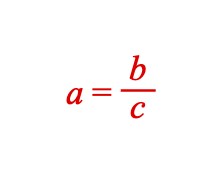

# Example 5 - Simple Equation

A simple equation including a fraction.

Open `index.html` in a browser to view example.



## Code
`index.js`
```js
const figure = new Fig.Figure({ color: [1, 0, 0, 1] });

figure.add(
  // Add equation element
  {
    name: 'eqn',
    method: 'equation',
    options: {
      // Equation elements are the individual terms in the equation
      elements: {
        a: 'a',
        b: 'b',
        c: 'c',
        v: { symbol: 'vinculum'},
        equals: ' = ',
      },
      // An equation form is how those terms are arranged
      forms: {
        base: ['a', 'equals', { frac: ['b', 'v', 'c'] }],
      },
    },
  },
);

```

## Explanation

Consider the equation:

```
a = b + c
```

We could also rearrange it to a different **form**:

```
a - b = c
```

These equations have a number of **terms** (a, b, c), an **operator** (+) and an equals sign (which we will call an **operator**).

Each of these **terms** and **operators** are figure elements - specifically [FigureElementPrimitive](https://airladon.github.io/FigureOne/#figureelementprimitive) objects that can behave as any other `FigureElement`. This means they can be touched, moved and animated.

An [Equation](https://airladon.github.io/FigureOne/#equation) object is a [FigureElementCollection](https://airladon.github.io/FigureOne/#figureelementcollection) that groups all the equation's elements and can arrange them into different equation **forms**.

In this example, the *equation elements* (**terms** and **operators**) are first defined in `options.elements`, then a *form* is defined in `options.forms.base` .

Some operators are either not in unicode, or are more convient to draw directly. In this example the *vinculum* of the fraction is a *symbol*.

Available *symbols* are in the [API Reference](https://airladon.github.io/FigureOne/#equation-symbols). They include symbols like radicals, integral symbols, brackets, arrows and more.

The fraction is a *layout function*. The available layout functions are also in the [API Reference](https://airladon.github.io/FigureOne/#equation-layout) and include functions like fractions, roots, subscript, matrix, annotations and more.
