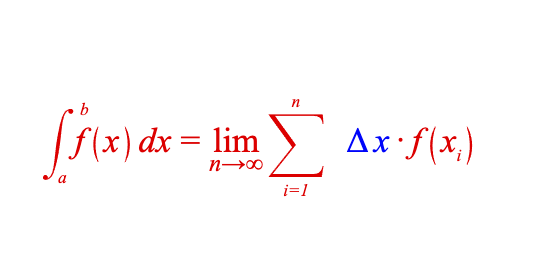

# Example 5 - Collections Equation

A more collections equation with an integral, sum operator, brackets, annotations, subscripts and color.

Open `index.html` in a browser to view example.



## Code
`index.js`
```js
const figure = new Fig.Figure();

figure.add(
  {
    name: 'eqn',
    method: 'equation',
    options: {
      color: [0.95, 0.95, 0.6, 1],
      position: [0, 0],
      // Not all elements need to be defined. Some can be inferred from the
      // form definition.
      // Typically, if the element needs properties (like color), or it has
      // text that is not compatible with a javascript object property name
      // (like " = "), then it should be defined in elements.
      // Full element definitions can happen in line in the form, but it tends
      // to reduce the readability of a form.
      elements: {
        lim: { style: 'normal' },
        integral: { symbol: 'int', sides: 20 },
        lb: { symbol: 'bracket', side: 'left' },
        lb1: { symbol: 'bracket', side: 'left' },
        rb: { symbol: 'bracket', side: 'right' },
        rb1: { symbol: 'bracket', side: 'right' },
        equals: ' = ',
        sigma: { symbol: 'sum', lineWidth: 0.006 },
        delta: { text: '\u0394', color: [1, 0, 0, 1] },
        x_1: { text: 'x', color: [1, 0, 0, 1]},
      },
      // An equation form is how those terms are arranged
      formDefaults: { alignment: { xAlign: 'center', yAlign: 'center' } },
      forms: {
        base: [
          {
            int: {
              symbol: 'integral',
              content: [
                // 'f' hasn't been definied in elements, so this is an inline
                // definition. In this case, the element name will be 'f', the
                // text it shows will be 'f', and its color will be the default
                // color
                'f',
                {
                  brac: {
                    left: 'lb',
                    content: 'x',
                    right: 'rb',
                    outsideSpace: 0.05,
                  }
                }, 'dx'],
              from: 'a',
              to: 'b',
            },
          },
          'equals',
          {
            annotate: {
              content: 'lim',
              annotation: {
                content: 'n\u2192\u221e',
                xPosition: 'center',      // Position is relative to content
                xAlign: 'center',         // Alignment is relative to annotation
                yPosition: 'bottom',
                yAlign: 'top',
                scale: 0.7,
              }
            }
          },
          ' ',
          {
            sumOf: {
              symbol: 'sigma',
              from: 'i=1',
              to: 'n',
              content: [
                // Both x and f have been defined before. These inline element
                // definitions include a '_1' as they need a unique element
                // name. In this case, the element name will be 'f_1', but the
                // element text will be 'f' (everything before the first '_')
                ' ', 'delta', ' ', 'x_1', ' ', '\u00b7', ' ', 'f_1',
                {
                  brac: {
                    left: 'lb1',
                    content: { sub: ['x_2', 'i'] },
                    right: 'rb1',
                    outsideSpace: 0.05,
                    bottomSpace: 0.02,
                  }
                },
              ],
            },
          },
        ],
      },
    },
  },
);

// Show the equation form
figure.getElement('eqn').showForm('base');
figure.initialize();
```

## Explanation

An equation with a more collections layout shows more features of equations in FigureOne.

### Element Definition
Equations are defined with two main keys, `elements` and `forms`.

Each equation element is a `FigureElementPrimitive` with a unique name. Therefore, if you have an equation with several *x* elements, you will need to give them each unique names. This is so when equations are animated between forms, it is clear which *x* in the first form moves to which *x* in the second form.

Therefore, one way to define multiple *x* elements would be:
```js
      elements: {
        _2: '2',
        x: 'x',
        x_1: 'x',
        x_2: 'x',
        plus: ' + ',
        equals: ' = ',
      },
      forms: {
        base: ['_2', 'x', 'equals', 'x_1', 'plus', 'x_2']
      },
```

But simple elements don't necessarily need to be defined in the `elements`. They can be defined inline in `forms`.

The form lists a series of strings that refer to element names. If a string isn't already associated with an element name, then the `Equation` will make a new element with that name.

The text of the element will be all the text before the first underscore after the first character.

For example, the string `'x_1'` will create an element with name `'x_1'` and text `'x'`.

As it is not a good idea to make object propery names start with a number, a number can be defined with a leading underscore. For example `'_2'` would create and element with name `'_2'` and text `'2'`. If there were multiple `2` elements in the equation, the second one might be defined with the string `'_2_1'`.

Therefore, you could also use the below code to achieve the same result as the above code:
```js
      elements: {
        plus: ' + ',
        equals: ' = ',
      },
      forms: {
        base: ['_2', 'x', 'equals', 'x_1', 'plus', 'x_2']
      },
```

Especially in larger, more complicated equations, doing inline form definition of elements for simple elements is useful for readability.

In the example code then, we have several elements including `f`, `x`, `dx`, `a` and `b` to name just a few that are defined in the form itself.

### Equation Layout Functions

An equation form is a series of equation elements that are laid out sequentially in an array.

More complicated layouts (such as fractions, integrals, subscripts etc) are defined in objects with properties as input parameters.

For example, a fraction might be defined verbosely in *object* form as:
```js
    elements: {
      v: { symbol: 'vinculum' },
    },
    forms: {
      base: {
        frac: {
          numerator: 'a',
          symbol: 'v',
          denominator: 'b',
        },
      },
    },
```

This can also be defined in short hand *array* form where the order of elements is `numerator`, `symbol`, `denominator`.

```js
      elements: {
        v: { symbol: 'vinculum' },
      },
      forms: {
        base: { frac: ['a', 'v', 'b'] },
      },
```

Most of the time, either *object* form or *array* form can be used interchangably for whichever form or combination of forms offers the best code readability.

However, if parameters (such as spacing) need to be defined, then only Object form can be used.

```js
      elements: {
        v: { symbol: 'vinculum' },
      },
      forms: {
        base: {
          frac: {
            numerator: 'a',
            symbol: 'v',
            denominator: 'b',
            numeratorSpace: 0.1,
            denominatorSpace: 0.2,
          },
        },
      },
```

Now, let's take the `sumOf` code from the example:
```js
          {
            sumOf: {
              symbol: 'sigma',
              from: 'i=1',
              to: 'n',
              content: [
                ' ', 'delta', ' ', 'x_1', ' ', '\u00b7', ' ', 'f_1',
                {
                  brac: {
                    left: 'lb1',
                    content: { sub: ['x_2', 'i'] },
                    right: 'rb1',
                    outsideSpace: 0.05,
                    bottomSpace: 0.02,
                  }
                },
              ],
            },
          },
```

This code contains a combination of *object* and *array* definitions. 

The `sumOf` definition doesn't contain any extra parameters, but is defined with an *object* for readability.

The `brac` definition for brackets has extra space parameters, and so needs an *object* definition. Note, for simple expressions, inline text brackets could also be used instead of the bracket symbols. The advantage of the bracket symbols is you can precisely control how far they extend beyond the encompassing elements, they will be sized automatically to different sizes of content, and their size will animate between equation forms if the content size changes.

The `sub` definition for subscript is quite simple and is fine as an *array* definition.

