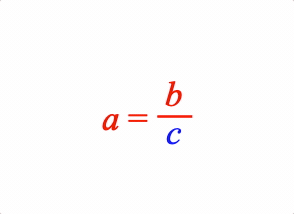

# Example 7 - Animation between Equation Forms

Animating between two forms of an equation.

Open `index.html` in a browser to view example.



## Code
`index.js`
```js
const figure = new Fig.Figure();

figure.addElement(
  {
    name: 'eqn',
    method: 'equation',
    options: {
      color: [0.95, 0.95, 0.6, 1],
      position: [0, 0],
      elements: {
        v: { symbol: 'vinculum'},
        equals: ' = ',
        times: ' \u00D7 ',
        c: { color: [1, 0, 0, 1] },
      },

      // Align all forms to the 'equals' figure element
      formAlignment: { alignment: { fixTo: 'equals' } },

      // Define two different forms of the equation
      forms: {
        '1': ['a', 'equals', { frac: ['b', 'v', 'c'] }],
        '2': {
          content: ['c', 'times', 'a', 'equals', 'b'],
          // Define how the 'c' element will move to this form
          translation: {
            c: { style: 'curved', direction: 'down', mag: 0.5 },
          }
        },
      },
    },
  },
);
figure.initialize();

const eqn = figure.getElement('eqn');

// Show the equation form
eqn.showForm('1');

// Animate to the next form
eqn.goToForm({
  name: '2',
  delay: 1,
  duration: 1.5,
  animate: 'move',
});

// Queue drawing on the next animation frame
figure.animateNextFrame();
```

## Explanation

In this example we are defining two different forms of the same equation.
```js
        '1': ['a', 'equals', { frac: ['b', 'v', 'c'] }],
```

```js
        '2': {
          content: ['c', 'times', 'a', 'equals', 'b'],
          // Define how the 'c' element will move to this form
          translation: {
            c: { style: 'curved', direction: 'down', mag: 0.5 },
          }
        },
```

The first form is defined in shorthand *Array* notation. The second form is defined in longer hand *Object* notation as we wish to include the form parameter `translation`.

This parameter defines how elements will move when translated in an animation. In this case we want the element `c` to follow a `curved` path, in the `down` direction where the curve has a magnitude of `0.5`.

We can then show the first form of the equation:
```js
eqn.showForm('1');
```

And animate to the second form:
```js
eqn.goToForm({
  name: '2',
  delay: 1,
  duration: 1.5,
  animate: 'move',
});
```

Finally we need to queue an animation frame to the form animation can start:
```js
figure.animateNextFrame();
```