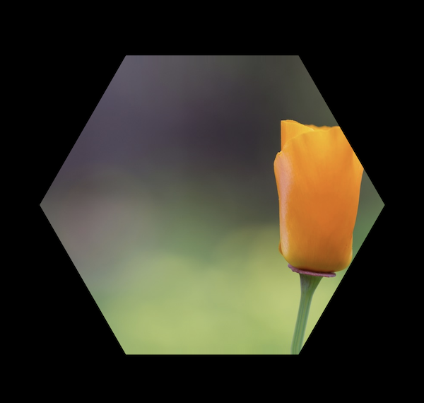

# Example 8 - Textures

Shapes can either be filled with colors or textures where textures come from an image file.

As loading images into local html can be inhibited by web browser security settings, this example needs to be loaded from a web server.

You can create a local web server and host the example by navigating to the examples folder then either use python or node to start a server:

This can all be done after cloning this repository:

```bash
git clone https://github.com/airladon/FigureOne
```

Then, from the repository root, start the development container (you will need to install docker if you don't already have it installed):
```bash
./start.sh dev
```

The container will start and present a command prompt:
```bash
cd examples/8\ -\ Texture/
python -m http.server 8080
```

Alternately, a node server can also be used from the initial path
```
http-server examples/8\ -\ Texture
```

You can then open a browser and go to http://localhost:8080.





## Code
`index.js`
```js
const figure = new Fig.Figure();

figure.addElement(
  {
    name: 'flower',
    method: 'polygon',
    options: {
      radius: 0.8,
      sides: 6,
      fill: true,
      texture: {
        src: 'texture-rect.jpg',
        mapTo: new Fig.Rect(-1, -0.667, 2, 1.333),
      },
    },
  },
);

figure.initialize();
```

## Explanation

Most shapes can use a [Texture Object](../../docs/README.md#OBJ_Texture) to define a texture instead of a color.

Here we are using the `texture-rect.jpg` image. The image will be mapped directly to the shape, so if the shape's aspect ratio is different to that of the image you will need to either define a rectangle in the image to map to the shape (`mapFrom`), define the coordinates in the space the shape is defined in that you want to map the image to (`mapTo`).

```js
      texture: {
        src: 'texture-rect.jpg',
        mapTo: new Fig.Rect(-1, -0.667, 2, 1.333),
      },
```
Here we are mapping to the shape shape space with a rectangle that is a little larger than the shape.
