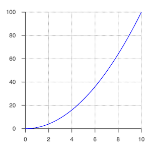

# Tutorial 9 - Plot

A simple equation including a fraction.

Open `index.html` in a browser to view example.



## Code
`index.js`
```js
const figure = new Fig.Figure();

const pow = () => {
  const xValues = Fig.tools.math.range(0, 10, 0.05);
  return xValues.map(x => [x, x ** 2]);
};

// Plot of single trace with auto axis scaling
figure.add({
  name: 'plot',
  method: 'collections.plot',
  options: {
    trace: pow(),
  },
});
```

## Explanation

Plotting can be as simple, or as customized as desired. This example shows the simplest way to plot out a trace.

A trace is an array of points, that will be plotted against an x and y axis. While axes can be fully customized, this example uses auto generated axes that will show the entire trace.

The trace is defined by:

```js
const pow = () => {
  const xValues = Fig.tools.math.range(0, 10, 0.05);
  return xValues.map(x => [x, x ** 2]);
};
```

This generates a range of x axis values from 0 to 10, and calculates the corresponding y values as the square of x. Of course, any array of points can be used, and this is just an example.

The plot is then generated by passing the trace values into the 'options.trace' property:

```js
// Plot of single trace with auto axis scaling
figure.add({
  name: 'plot',
  method: 'collections.plot',
  options: {
    trace: pow(),
  },
});
```